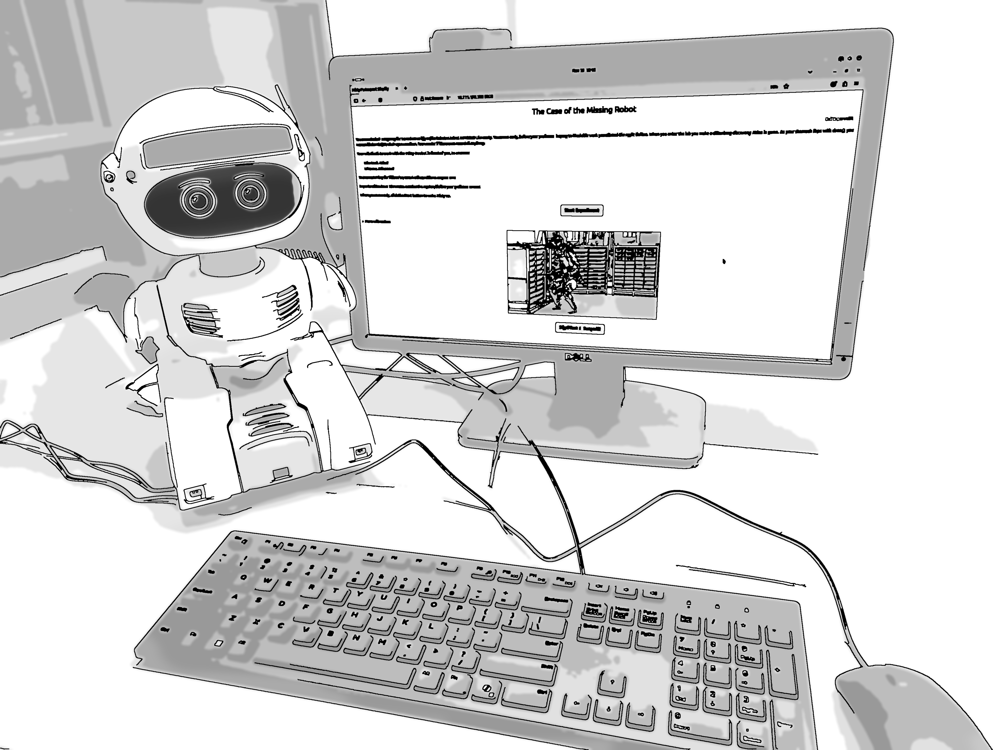

<!--Include academic icons or bottons-->

## Abstract

Trust plays a central role in human--robot collaboration, yet its formation is rarely examined under the constraints of fully autonomous interaction. This pilot study investigated how interaction policy influences trust during in-person collaboration with a social robot operating without Wizard-of-Oz control or scripted repair. Participants completed a multi-stage collaborative task with a mobile robot that autonomously managed spoken-language dialogue, affect inference, and task progression. Two interaction policies were compared: a responsive policy, in which the robot proactively adapted its dialogue and assistance based on inferred interaction state, and a neutral, reactive policy, in which the robot provided only direct, task-relevant responses when prompted. Responsive interaction was associated with significantly higher post-interaction trust under viable communication conditions, despite no reliable differences in overall task accuracy. Sensitivity analyses indicated that affective and experiential components of trust were more sensitive to communication breakdown than evaluative judgments of reliability, and that as language-mediated interaction degraded, the trust advantage associated with responsiveness attenuated and ratings became less clearly interpretable as calibrated evaluations of collaborative competence. These findings suggest that trust in autonomous human--robot interaction emerges from process-level interaction dynamics and operates within constraints imposed by communication viability, highlighting the importance of evaluating trust under real autonomy conditions when designing interactive robotic systems. 

## Links

Published [paper](https://arxiv.org/abs/2603.00154)

Research [poster](sheron-trustinrobots-researchweek-2026.pdf)

